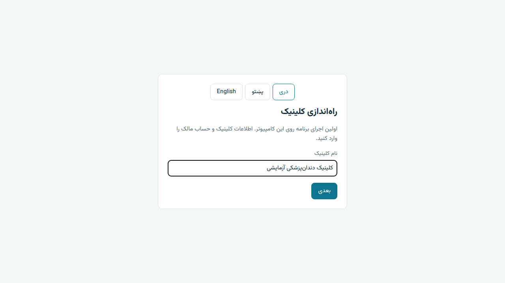
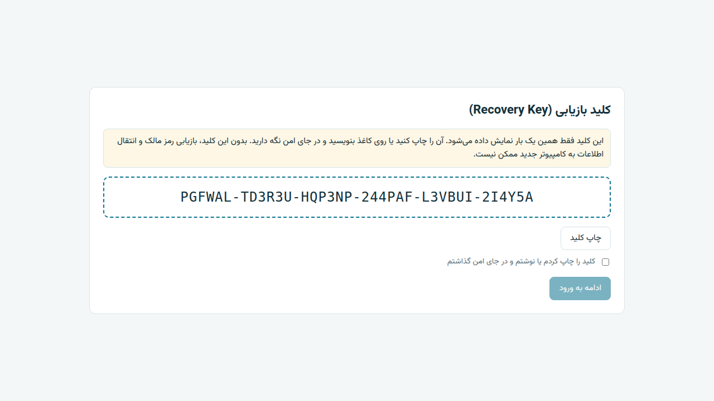
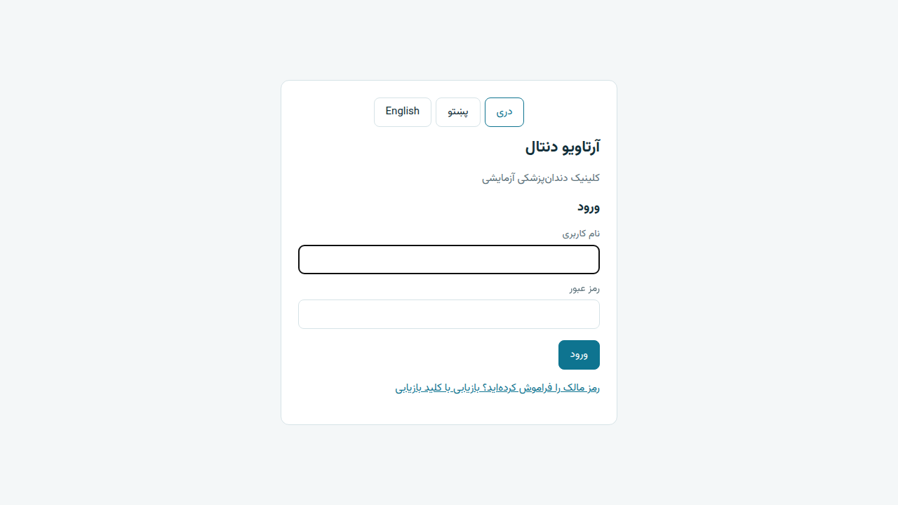
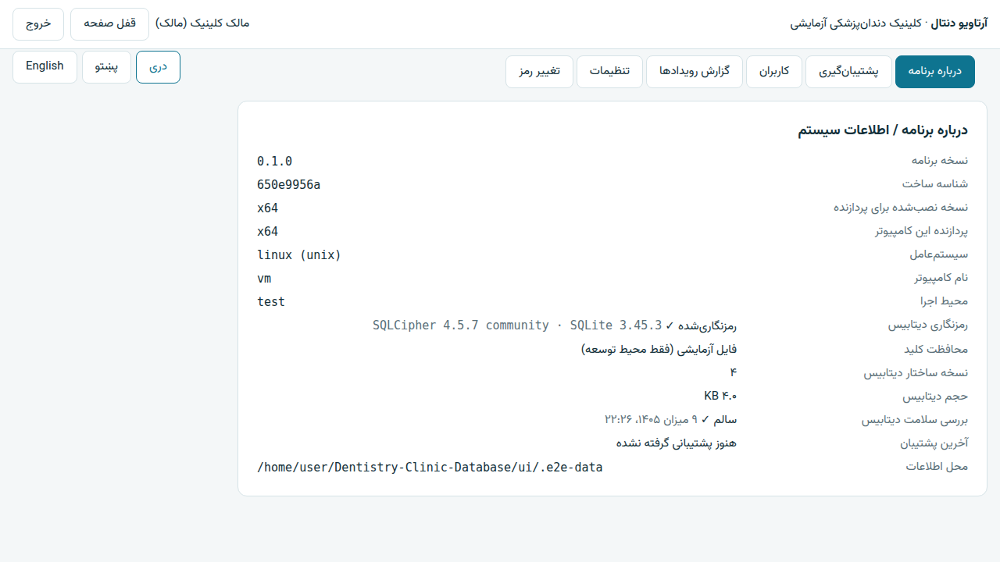
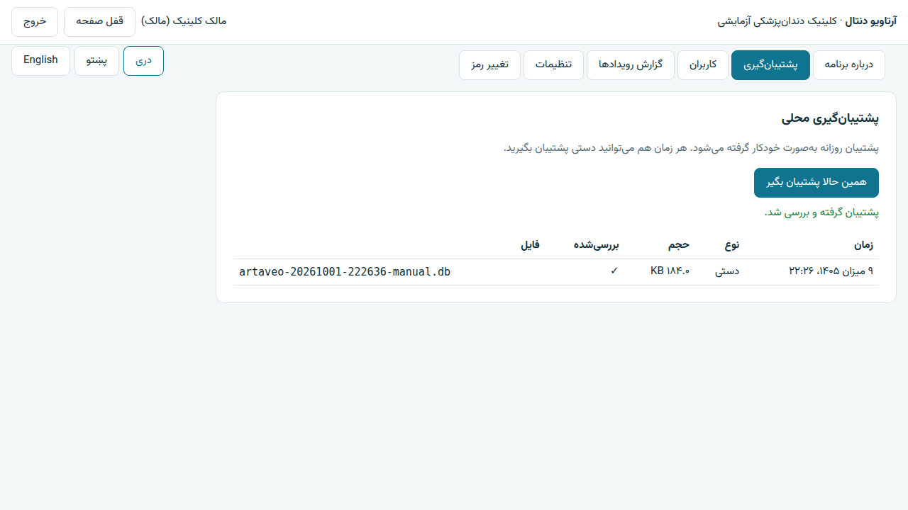
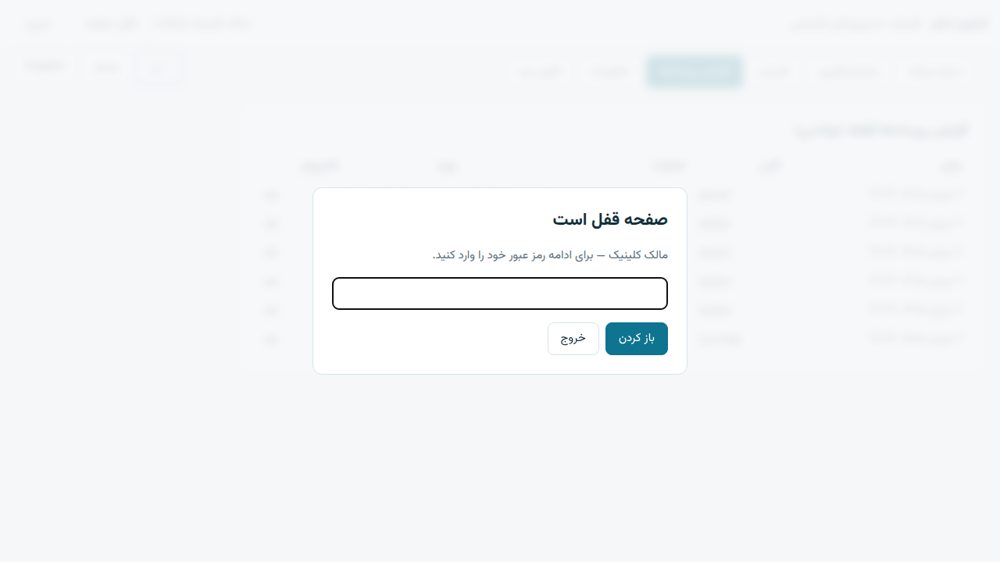

# راهنمای تست دستی — فاز ۱

این راهنما برای **مالک محصول** است و دانش فنی لازم ندارد. هر مرحله را انجام دهید و نتیجه را در جدول آخر بنویسید. اگر چیزی با متن راهنما فرق داشت، از صفحه عکس بگیرید (کلید `Windows` + `Shift` + `S`).

> زمان لازم: حدود ۳۰ دقیقه برای هر کامپیوتر.

---

## ۰. کدام فایل را نصب کنم؟

فایل‌ها در صفحه **Releases** مخزن GitHub هستند (بخش Assets نسخه `v0.1.0`).

**نوع کامپیوتر را پیدا کنید:** دکمه Start → Settings → System → About → سطر **System type**:

| آنچه در System type نوشته شده | فایلی که نصب کنید |
|---|---|
| `64-bit operating system, x64-based processor` | `ArtaveoDental-Setup-x64.exe` |
| `32-bit operating system, x86-based processor` یا `x64-based processor` با سیستم‌عامل 32-bit | `ArtaveoDental-Setup-x86.exe` |
| `64-bit operating system, ARM-based processor` | `ArtaveoDental-Setup-arm64.exe` |

اگر کامپیوتر **اینترنت ندارد**، نسخه‌ای که آخر نامش `-offline` است را نصب کنید.

اگر چند نوع کامپیوتر دارید، روی هر کدام فایل مخصوص خودش را تست کنید. حداقل یک بار هم روی یک کامپیوتر بدون اینترنت نسخه `-offline` را امتحان کنید.

---

## ۱. نصب

1. فایل را دوبار کلیک کنید.
2. اگر پنجره آبی **«Windows protected your PC»** آمد: روی **More info** و بعد **Run anyway** کلیک کنید. (این هشدار طبیعی است؛ برنامه هنوز امضای دیجیتال ندارد.)
3. اگر ویندوز اجازه مدیر (Administrator) خواست، **Yes** بزنید.
4. مراحل نصب را با **Next / Install** تمام کنید.

✅ **باید ببینید:** نصب بدون خطا تمام شود و آیکن **Artaveo Dental** روی دسکتاپ یا منوی Start باشد.

---

## ۲. راه‌اندازی اولیه کلینیک

برنامه را باز کنید. صفحه **«راه‌اندازی کلینیک»** می‌آید.

1. بالای صفحه زبان را امتحان کنید: **پښتو** و **English** و دوباره **دری**. متن‌ها باید عوض شوند؛ در English متن از چپ به راست باشد.
2. نام کلینیک را بنویسید → **بعدی**.
3. نام کاربری مالک (فقط حروف انگلیسی، مثلاً `owner`)، نام نمایشی و رمز عبور (حداقل ۸ حرف) را وارد کنید.
4. **عمداً** در «تکرار رمز عبور» چیز دیگری بنویسید و **ایجاد کلینیک** را بزنید.
   ✅ باید پیام «رمزها یکسان نیستند» بیاید.
5. تکرار رمز را درست کنید و **ایجاد کلینیک** را بزنید.

✅ **باید ببینید:** صفحه **«کلید بازیابی»** با یک کد ۳۶ حرفی (۶ گروه، جدا با خط تیره).

6. دکمه **ادامه به ورود** باید غیرفعال (کم‌رنگ) باشد.
7. **چاپ کلید** را بزنید. (اگر پرینتر ندارید، Microsoft Print to PDF را انتخاب کنید.) در پیش‌نمایش چاپ فقط کلید و نام کلینیک باید باشد.
8. کلید را روی کاغذ هم بنویسید — در مرحله ۸ لازم است.
9. تیک «کلید را چاپ کردم…» را بزنید → **ادامه به ورود**.

---

## ۳. ورود

1. نام کاربری درست و رمز **اشتباه** → **ورود**. ✅ پیام «نام کاربری یا رمز عبور اشتباه است.»
2. رمز درست → **ورود**. ✅ بالای صفحه نام شما و «(مالک)» دیده شود.

---

## ۴. صفحه «درباره برنامه»

بعد از ورود، این صفحه باز است.

✅ **باید ببینید:**

| سطر | مقدار درست |
|---|---|
| نسخه برنامه | `0.1.0` |
| نسخه نصب‌شده برای پردازنده | همان فایلی که نصب کردید: `x64` یا `x86` یا `arm64` |
| پردازنده این کامپیوتر | نوع واقعی کامپیوتر |
| رمزنگاری دیتابیس | **رمزنگاری‌شده ✓** |
| محافظت کلید | **Windows DPAPI (همین کامپیوتر)** |
| بررسی سلامت دیتابیس | بعد از چند ثانیه **سالم ✓** |
| آخرین پشتیبان | «هنوز پشتیبانی گرفته نشده» یا یک تاریخ (اگر پشتیبان خودکار گرفته شده باشد) |

اگر نسخه x86 را روی کامپیوتر ۶۴ بیتی یا ARM نصب کرده باشید، باید یک **پیام زرد** بگوید «این نسخه برای پردازنده دیگری ساخته شده…». این درست است.

---

## ۵. پشتیبان‌گیری

1. زبانه **پشتیبان‌گیری** → **همین حالا پشتیبان بگیر**.
   ✅ پیام سبز «پشتیبان گرفته و بررسی شد.» و یک سطر در جدول با نوع «دستی».
2. به **درباره برنامه** برگردید. ✅ «آخرین پشتیبان» حالا تاریخ امروز را دارد (تاریخ شمسی، مثل «۹ میزان ۱۴۰۵»).
3. (اختیاری) در File Explorer آدرس `C:\ProgramData\ArtaveoDental\backups` را باز کنید: باید یک فایل `.db` و یک فایل `.rkey` باشد.

---

## ۶. کاربران و دسترسی‌ها

1. زبانه **کاربران** → در فرم پایین: نام کاربری `reception`، نام نمایشی «پذیرش»، رمز (۸ حرف یا بیشتر)، نقش **پذیرش** → **افزودن کاربر**.
   ✅ پیام «کاربر ایجاد شد.» و کاربر در جدول دیده شود.
2. زبانه **گزارش رویدادها**. ✅ این موارد در جدول باشند: `app.setup`، `auth.login_failed` (رمز اشتباه مرحله ۳)، `auth.login`، `backup.create`، `user.create`. هیچ دکمه حذف یا ویرایش نباید وجود داشته باشد.
3. **خروج** → با `reception` وارد شوید.
   ✅ فقط زبانه‌های **درباره برنامه** و **تغییر رمز** دیده شوند (کاربران، پشتیبان‌گیری، گزارش رویدادها و تنظیمات **نباید** باشند).
4. خروج و دوباره با مالک وارد شوید.

---

## ۷. قفل صفحه

1. **قفل صفحه** را بزنید. ✅ صفحه تار شود و فقط کادر رمز دیده شود.
2. رمز اشتباه → **باز کردن**. ✅ پیام خطا.
3. رمز درست → **باز کردن**. ✅ برنامه دوباره قابل استفاده شود.
4. **قفل خودکار:** زبانه **تنظیمات** → «قفل خودکار پس از» را `1` بگذارید → **ذخیره**. دو دقیقه به موس و کیبورد دست نزنید. ✅ صفحه خودش قفل شود. بعد آن را به `10` برگردانید.

---

## ۸. بازیابی رمز مالک با کلید بازیابی

1. **خروج**.
2. روی «رمز مالک را فراموش کرده‌اید؟…» کلیک کنید.
3. یک کلید **اشتباه** (مثلاً یک حرف را عوض کنید) و یک رمز جدید → **تغییر رمز مالک**. ✅ پیام «کلید بازیابی درست نیست.»
4. کلید درست (همان که در مرحله ۲ نوشتید؛ حروف کوچک و بزرگ فرق ندارد) و رمز جدید → **تغییر رمز مالک**.
   ✅ پیام سبز «رمز مالک تغییر کرد.»
5. با رمز **قدیمی** وارد شوید ← ✅ رد شود. با رمز **جدید** ← ✅ وارد شوید.

---

## ۹. باز و بسته کردن و حذف/نصب دوباره

1. برنامه را کامل ببندید و دوباره باز کنید. ✅ صفحه **ورود** بیاید (نه راه‌اندازی) و نام کلینیک درست باشد.
2. از Settings → Apps برنامه **Artaveo Dental** را Uninstall کنید، بعد دوباره همان فایل را نصب کنید.
   ✅ بعد از نصب دوباره، صفحه **ورود** بیاید و با رمز جدید وارد شوید — **اطلاعات نباید پاک شده باشد.**

---

## ۱۰. ثبت نتیجه

برای هر کامپیوتر یک نسخه از این جدول را پر کنید.

**کامپیوتر:** ……………… **System type:** ……………… **فایل نصب‌شده:** ………………

| # | مرحله | قبول ✅ / رد ❌ | توضیح یا نام فایل عکس |
|---|---|---|---|
| 1 | نصب | | |
| 2 | راه‌اندازی و کلید بازیابی | | |
| 3 | ورود | | |
| 4 | درباره برنامه (نسخه، پردازنده، رمزنگاری، سلامت) | | |
| 5 | پشتیبان‌گیری | | |
| 6 | کاربران و دسترسی‌ها | | |
| 7 | قفل صفحه (دستی و خودکار) | | |
| 8 | بازیابی رمز مالک | | |
| 9 | باز/بسته کردن و نصب دوباره | | |

نتیجه را همراه عکس‌ها برای تیم توسعه بفرستید. هر مورد «رد» قبل از شروع فاز ۲ بررسی می‌شود.

---

عکس‌های این راهنما به‌صورت خودکار از تست E2E گرفته شده‌اند (`SCREENSHOTS=1 npx playwright test` در پوشه `ui`) و ممکن است جزئیات ظاهری کمی با نسخه ویندوز فرق داشته باشد. برای تست، فقط از حساب‌ها و اطلاعات آزمایشی استفاده کنید.
