# راهنمای تست دستی — نسخه v0.2.1 (پایان فاز ۲)

این راهنما برای **مالک محصول** است و دانش فنی لازم ندارد. هر مرحله را انجام دهید و نتیجه را در جدول آخر بنویسید. اگر چیزی با متن راهنما فرق داشت، از صفحه عکس بگیرید (کلید `Windows` + `Shift` + `S`).

> **فقط روی یک کامپیوتر** (لپ‌تاپ خودتان) — طبق «سیاست تست دستی» رودمپ. نصب و ارتقا روی هر سه نوع پردازنده (x64، x86، ARM64) را CI به‌صورت خودکار تست کرده است (نصب نسخه 0.1.0 ← ارتقا به 0.2.1 ← فقط یک برنامه در فهرست و اطلاعات کلینیک دست‌نخورده).
>
> زمان لازم: حدود ۶۰ دقیقه. این راهنما هم همه موارد فاز ۲ را دوباره تست می‌کند (چون ظاهر برنامه از پایه نو شده) و هم **رفع شدن هر ۱۳ مورد بازخورد شما (OF-001 تا OF-013)** را جداگانه بررسی می‌کند. در هر بخش، شماره OF مربوط نوشته شده است.

---

## ۰. کدام فایل را نصب کنم؟

فایل‌ها در صفحه **Releases** مخزن GitHub، نسخه `v0.2.1`، بخش Assets هستند.

| کامپیوتر شما | فایل |
|---|---|
| لپ‌تاپ ARM (مثل لپ‌تاپ تست فاز ۱ شما — Snapdragon) | `ArtaveoDental-Setup-arm64.exe` |
| ویندوز ۶۴ بیتی معمولی (Intel/AMD) | `ArtaveoDental-Setup-x64.exe` |
| ویندوز ۳۲ بیتی | `ArtaveoDental-Setup-x86.exe` |

نسخه‌های `-offline` برای کامپیوتر بدون اینترنت هستند.

---

## ۱. ارتقا روی نسخه قبلی — یک برنامه، اطلاعات حفظ‌شده (OF-009)

1. **قبل از نصب:** `Settings` ویندوز ← `Apps` ← `Installed apps` را باز کنید و «Artaveo» را جستجو کنید. ببینید چه چیزهایی هست (مثلاً `Artaveo Dental 0.1.0` یا `0.2.0`، و `Artaveo Dental Spike 0.0.0`).
2. **Artaveo Dental Spike** برنامه آزمایشی فاز ۰ بود و ارتقا پیدا نمی‌کند؛ اگر هنوز هست، همین‌جا با **Uninstall** حذفش کنید (طبق تصمیم خودتان).
3. فایل `v0.2.1` را دوبار کلیک کنید؛ هشدار SmartScreen را با **More info ← Run anyway** رد کنید و نصب را تمام کنید.
4. دوباره `Installed apps` را نگاه کنید.

✅ **باید ببینید:** فقط **یک** «Artaveo Dental» با نسخه **0.2.1** — نسخه قبلی جداگانه باقی نمانده باشد.

5. برنامه را باز کنید. اول **صفحه شروع** با لوگوی Artaveo روی زمینه تیره می‌آید و بعد صفحه ورود.
6. با **همان نام کاربری و رمزی که در تست قبلی ساخته بودید** وارد شوید.

✅ **باید ببینید:** نام کلینیک قبلی‌تان و کاربرانی که قبلاً ساخته بودید سر جایشان باشند (زبانه «کاربران») و پشتیبان‌های قبلی در زبانه «پشتیبان‌گیری» دیده شوند.

---

## ۲. شروع تازه برای تست ویزارد

برای اینکه ویزارد راه‌اندازی را دوباره ببینید، اطلاعات آزمایشی قبلی را **کنار می‌گذاریم** (پاک نمی‌کنیم):

1. برنامه را ببندید.
2. `File Explorer` را باز کنید، در نوار آدرس بالا `C:\ProgramData` را بنویسید و `Enter` بزنید.
3. روی پوشه `ArtaveoDental` راست‌کلیک ← **Rename** ← نامش را `ArtaveoDental-old` بگذارید.
4. برنامه را دوباره باز کنید.

✅ **باید ببینید:** بعد از صفحه شروع، **ویزارد راه‌اندازی** باز شود.

> اگر بعداً خواستید اطلاعات قبلی برگردد: برنامه را ببندید، پوشه تازه `ArtaveoDental` را به نام دیگری تغییر دهید و `ArtaveoDental-old` را دوباره `ArtaveoDental` کنید.

---

## ۳. ویزارد راه‌اندازی (OF-001، OF-003، OF-007، OF-010)

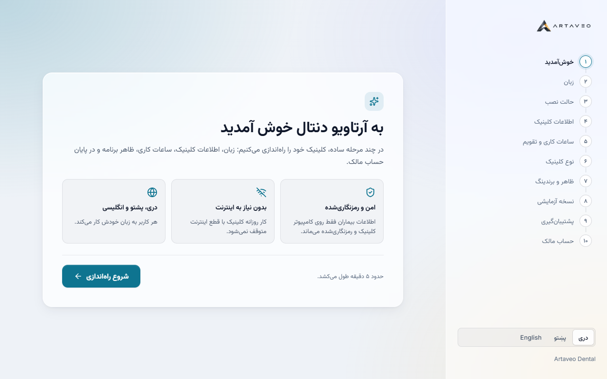

1. **خوش‌آمدید:** سمت راست فهرست ۱۰ مرحله و لوگوی Artaveo دیده شود. زبان را از پایین فهرست امتحان کنید (پښتو / English / دری) و برگردید به دری ← **شروع راه‌اندازی**.
2. **زبان:** یکی از سه کارت را انتخاب کنید ← **بعدی**.
3. **حالت نصب:** «سرور کلینیک» و «اتصال به سرور» کم‌رنگ و غیرفعال با برچسب «در فاز بعدی فعال می‌شود»؛ «تک‌کامپیوتر» را انتخاب کنید ← **بعدی**.
4. **اطلاعات کلینیک:** نام کلینیک را بنویسید. یک عکس کوچک PNG یا JPG به‌عنوان لوگو انتخاب کنید (اختیاری). ولایت و ولسوالی، آدرس.
   * در کادر **شماره تماس** عمداً `abc` بنویسید.

   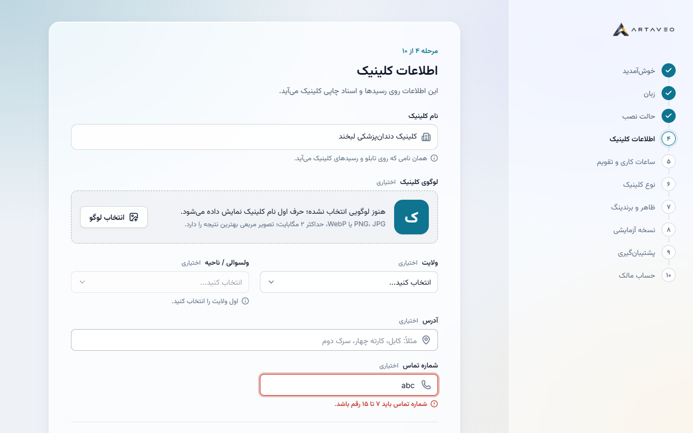

   ✅ (OF-003) **قبل از زدن هیچ دکمه‌ای** همان کادر قرمز شود و زیرش بنویسد «شماره تماس باید ۷ تا ۱۵ رقم باشد.». راهنمای هر کادر (متن خاکستری زیر کادر) از اول دیده شود.
   * شماره درست بنویسید (مثلاً `0700 123 456`) ← خطا فوراً برود ← **بعدی**.
5. **ساعات کاری و تقویم:**

   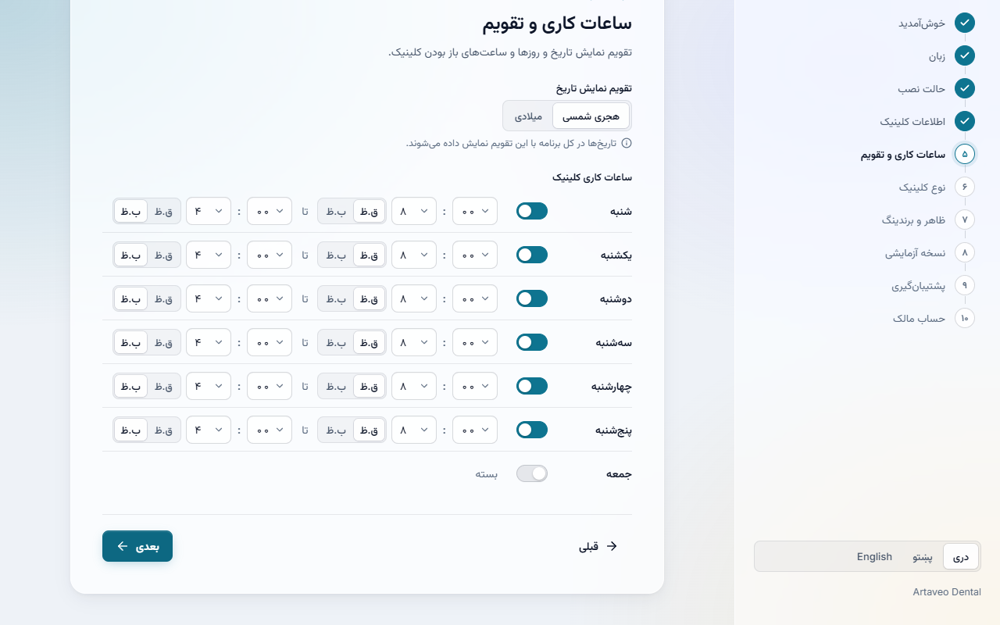

   ✅ (OF-007) ساعت‌ها **۱۲ ساعته** باشند: «۸ : ۰۰ ق.ظ تا ۴ : ۰۰ ب.ظ» — هیچ‌جا عدد ۰ تا ۲۳ نباشد. یک روز را با کلید کنارش «بسته» کنید و دوباره باز کنید. ساعت بسته شدن یک روز را قبل از ساعت باز شدنش بگذارید و **بعدی** بزنید ← ✅ پیام قرمز «ساعت بسته شدن باید بعد از ساعت باز شدن باشد» بیاید. درستش کنید ← **بعدی**.
6. **نوع کلینیک:** تک‌دکتر یا چند دکتر ← **بعدی**.
7. **ظاهر و رنگ‌ها:** روشن / تیره / مطابق سیستم را امتحان کنید — ✅ کل صفحه فوراً عوض شود. روی «رنگ اصلی» بزنید و رنگ دیگری انتخاب کنید ← ✅ «پیش‌نمایش زنده» و دکمه‌ها همان لحظه رنگ کلینیک را بگیرند ← **بعدی**.
8. **نسخه آزمایشی:** متن را بخوانید، تیک «متوجه شدم» ← **بعدی**.
9. **پشتیبان‌گیری:** ✅ نوشته باشد «هر روز، ساعت ۷:۰۰ ب.ظ» ← **بعدی**.
10. **حساب مالک (OF-001، OF-002، OF-003):**
    * در «نام کاربری» یک نام **فارسی** بنویسید (مثلاً `احمد`).
    * در «رمز عبور» فقط `1234` بنویسید.

    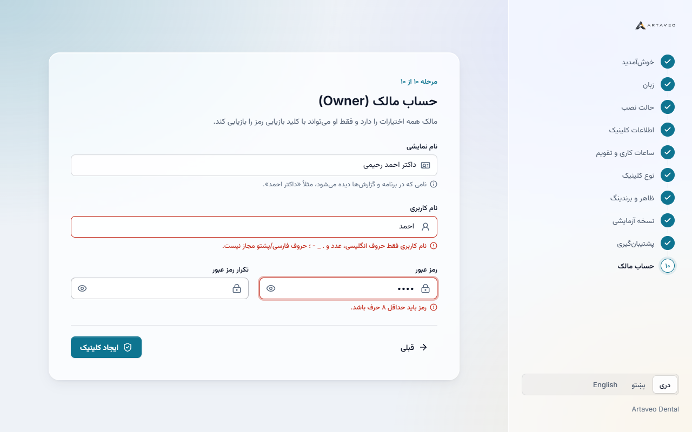

    ✅ **همان لحظه تایپ** (بدون زدن دکمه): کادر نام کاربری قرمز شود و زیرش بنویسد «نام کاربری فقط حروف انگلیسی، عدد و . _ - ؛ حروف فارسی/پشتو مجاز نیست.»؛ کادر رمز قرمز با «رمز باید حداقل ۸ حرف باشد.».
    * «تکرار رمز» را متفاوت بنویسید ← ✅ زیر همان کادر «تکرار رمز با رمز یکسان نیست.».
    * همه را درست کنید (نام کاربری انگلیسی، رمز ۸ حرف یا بیشتر) ← خطاها فوراً بروند ← **ایجاد کلینیک**.

✅ **باید ببینید:** صفحه **کلید بازیابی** با یک کد ۳۶ حرفی در ۶ گروه.

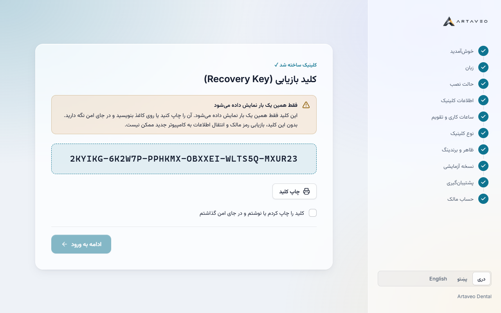

11. **چاپ کلید** را بزنید (یا کلید را یادداشت کنید — در مرحله ۱۸ لازم است)، تیک تأیید ← **ادامه به ورود**.

---

## ۴. صفحه ورود و برندینگ (OF-004، OF-011)

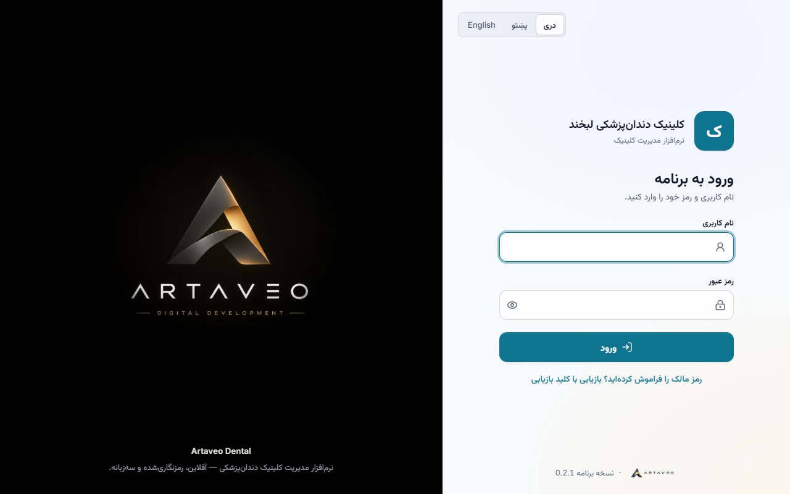

✅ **باید ببینید:**
* (OF-011) سمت چپ: لوگوی **Artaveo** روی زمینه تیره؛ سمت راست: **لوگو (یا حرف اول نام) و نام کلینیک شما** بالای فرم.
* (OF-004) در کادر نام کاربری چند حرف **فارسی** بنویسید: حروف باید **به هم وصل** و با همان فونت برنامه باشند، نه جدا جدا. بعد پاکش کنید.

1. با رمز اشتباه وارد شوید ← ✅ پیام قرمز «نام کاربری یا رمز عبور اشتباه است.» بالای کادرها.
2. با رمز درست وارد شوید.

---

## ۵. ظاهر کلی برنامه (OF-010) — مهم‌ترین بخش

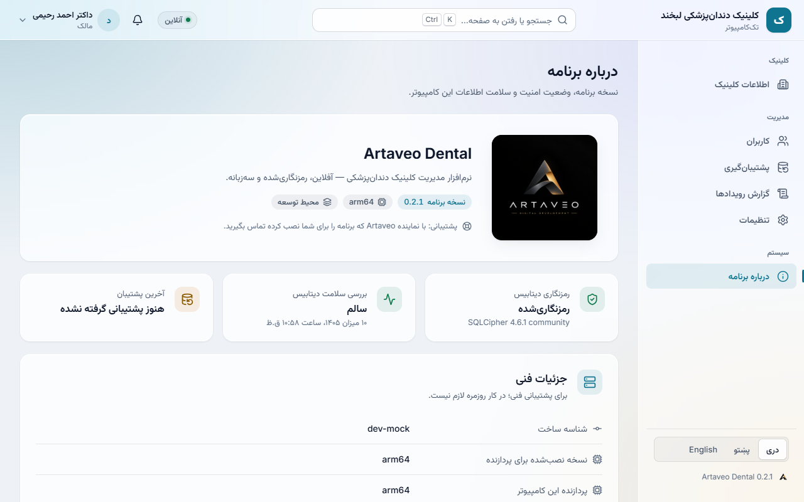

چند دقیقه در برنامه بگردید و با دقت نگاه کنید:

* ✅ بالای برنامه (هدر شیشه‌ای): **لوگو و نام کلینیک شما** در گوشه راست، کادر جستجو در وسط، «آنلاین»، زنگوله و نام شما در گوشه چپ (OF-011).
* ✅ منوی کناری با آیکن و سه گروه «کلینیک»، «مدیریت»، «سیستم»؛ صفحه فعال با رنگ ملایم و نوار رنگی کنارش.
* ✅ زمینه برنامه هاله رنگی ملایم دارد و کارت‌ها و هدر **نیمه‌شفاف شیشه‌ای** هستند؛ متن‌ها همه‌جا خوانا.
* ✅ فونت فارسی و انگلیسی هماهنگ و زیبا؛ هیچ‌جا فونت ماشین‌تحریری (monospace) نباشد جز کلید بازیابی.
* ✅ با بردن موس روی دکمه‌ها، سطرهای جدول و منو، رنگ ملایم عوض شود؛ با کلید `Tab` حلقه رنگی دور کادر/دکمه فعال دیده شود.
* مقایسه قبل و بعد: [اسکرین‌شات‌های v0.2.0 و v0.2.1](../design/screenshots/README.md).

نظر خودتان را درباره ظاهر در جدول آخر بنویسید (هر چیزی که هنوز «درجه‌یک» به نظر نمی‌رسد).

---

## ۶. جستجوی سریع، اعلان‌ها و منوی کاربر

1. `Ctrl` + `K` را بزنید (یا روی کادر جستجوی بالا کلیک کنید) ← ✅ پنجره جستجو باز شود. بنویسید «کار» ← «کاربران» دیده شود ← `Enter` ← به صفحه کاربران بروید.

   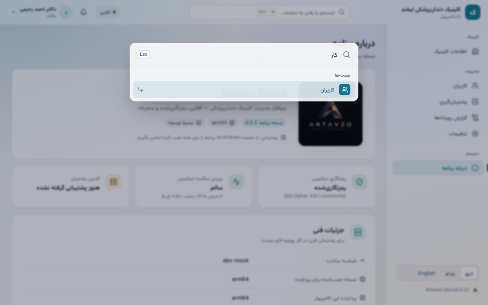
2. روی زنگوله بزنید ← ✅ «هیچ اعلانی نیست» (محتوا در فاز ۹).
3. روی نام خودتان (گوشه بالا) بزنید ← ✅ منوی کاربر: ظاهر (روشن/تیره/مطابق سیستم)، **حالت کارایی**، تغییر رمز، قفل صفحه، خروج.

   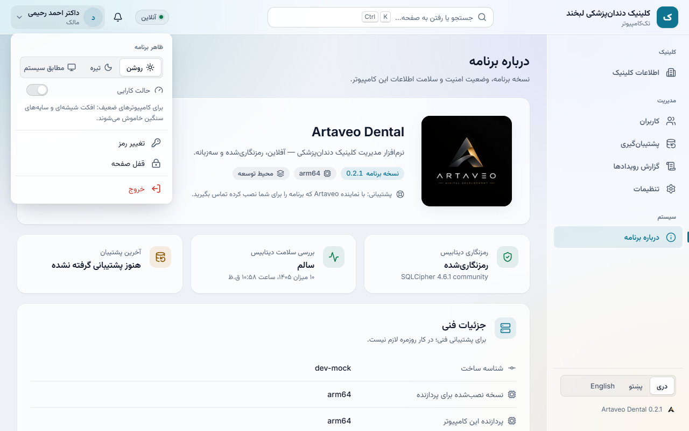
4. **حالت کارایی** را روشن کنید ← ✅ افکت شیشه‌ای و سایه‌ها حذف شوند ولی چیدمان همان بماند. دوباره خاموشش کنید.

---

## ۷. درباره برنامه (OF-006، OF-011)

✅ **باید ببینید:**
* کارت «Artaveo Dental» با لوگوی Artaveo، **نسخه 0.2.1**، نوع پردازنده (`arm64` روی لپ‌تاپ شما) و متن پشتیبانی.
* سه کارت: «رمزنگاری دیتابیس: رمزنگاری‌شده»، «بررسی سلامت دیتابیس: سالم»، «آخرین پشتیبان».
* (OF-006) بعد از مرحله ۸ (پشتیبان‌گیری) برگردید: تاریخ آخرین پشتیبان یک عبارت طبیعی باشد مثل «۱۰ میزان ۱۴۰۵، ساعت ۱:۱۴ ق.ظ» و **حجم در سطر جداگانه** («حجم: ۱۸۴٫۰ KB») — ترتیب به‌هم‌ریخته نباشد.

---

## ۸. پشتیبان‌گیری (OF-007)

1. زبانه **پشتیبان‌گیری** ← **همین حالا پشتیبان بگیر**.

✅ **باید ببینید:** پیام کوچک سبز پایین صفحه «پشتیبان گرفته و بررسی شد.»، یک سطر تازه در جدول با برچسب «دستی» و «سالم»، و ستون زمان با ساعت **۱۲ ساعته** (ق.ظ / ب.ظ). کارت «پشتیبان روزانه» بنویسد «هر روز، ساعت ۷:۰۰ ب.ظ».

---

## ۹. تنظیمات (OF-003، OF-007)

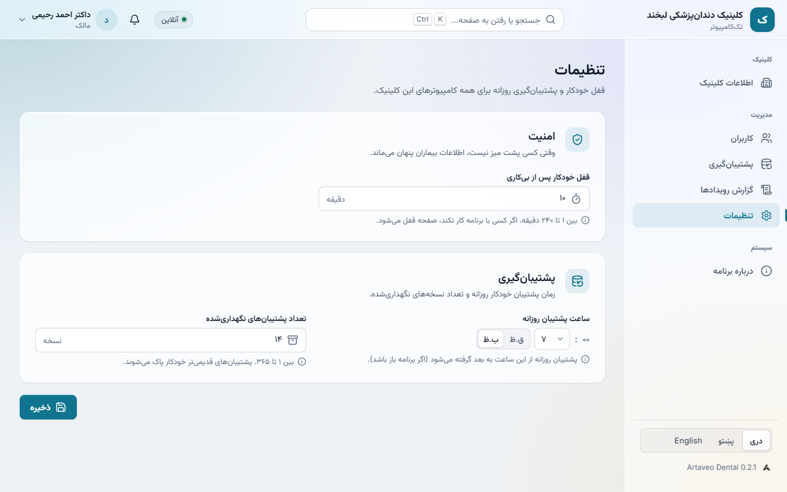

1. زبانه **تنظیمات**.
2. ✅ (OF-007) «ساعت پشتیبان روزانه» با **انتخاب‌گر ۱۲ ساعته** باشد (ساعت ۱ تا ۱۲ + ق.ظ/ب.ظ)، نه عدد ۰ تا ۲۳. آن را روی **۸ ق.ظ** بگذارید.
3. در «قفل خودکار پس از بی‌کاری» عدد `0` بنویسید ← ✅ (OF-003) همان کادر قرمز با «عددی بین ۱ تا ۲۴۰ وارد کنید.». عدد **`1`** بنویسید (برای تست قفل در مرحله ۱۳).
4. **ذخیره** ← ✅ پیام «تغییرات ذخیره شد.». در زبانه پشتیبان‌گیری حالا «هر روز، ساعت ۸:۰۰ ق.ظ» باشد.

---

## ۱۰. اطلاعات کلینیک (OF-007، OF-011)

1. زبانه **اطلاعات کلینیک**.
2. **انتخاب لوگو** / **تغییر لوگو** را بزنید و یک عکس انتخاب کنید ← ✅ لوگو فوراً هم اینجا و هم **در هدر بالای برنامه** عوض شود؛ بعد از خروج، در صفحه ورود هم دیده شود.
3. آدرس را تغییر دهید؛ در «ساعات کاری» ساعت یک روز را با انتخاب‌گر ۱۲ ساعته عوض کنید؛ رنگ اصلی را عوض کنید (✅ همان لحظه پیش‌نمایش) ← **ذخیره** ← ✅ «اطلاعات کلینیک ذخیره شد.».
4. به زبانه دیگری بروید و برگردید ← ✅ تغییرات مانده باشند.

---

## ۱۱. کاربران (OF-001، OF-002، OF-003، OF-005)

1. زبانه **کاربران** ← **افزودن کاربر**.
2. «نام نمایشی» را بنویسید، در «نام کاربری» یک نام **فارسی** بنویسید.

   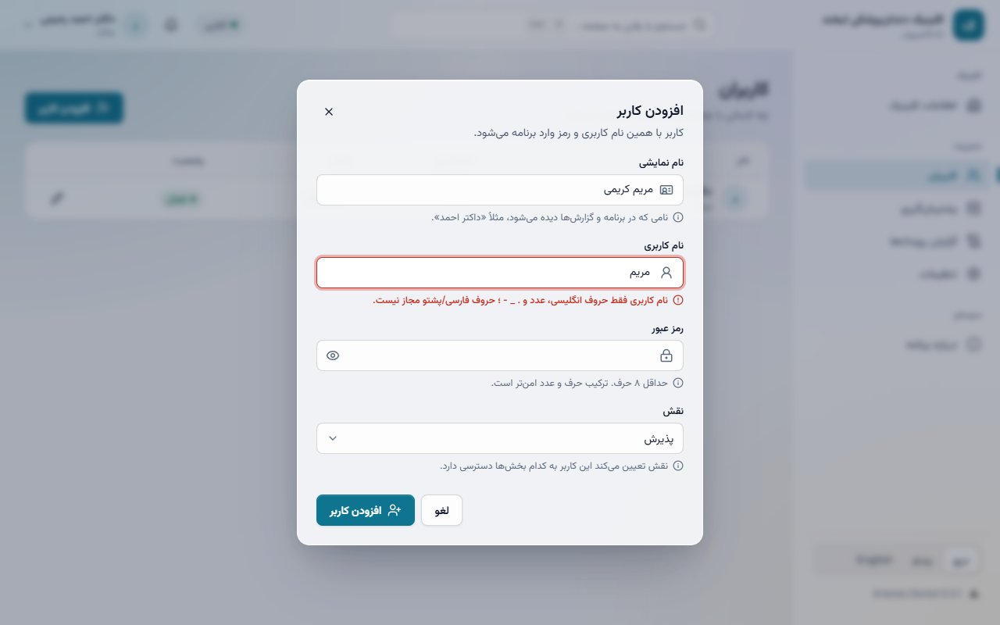

   ✅ (OF-001) همان لحظه، کادر قرمز با پیام دقیق زیرش.
3. حالا نام کاربری **خودتان** (مالک، مثلاً `owner`) را بنویسید، رمز ۸ حرفی بدهید و **افزودن کاربر** را بزنید.

   ✅ (OF-002) زیر **همان کادر نام کاربری** بنویسد «این نام کاربری قبلاً استفاده شده است؛ نام دیگری انتخاب کنید.» — نه یک پیام کلی «اطلاعات نامعتبر».
4. نام کاربری را `reception` کنید، رمز `reception-123`، نقش «پذیرش» ← **افزودن کاربر** ← ✅ پیام «کاربر ایجاد شد.» و سطر تازه در جدول.
5. ✅ (OF-005) در جدول، نام‌های کاربری انگلیسی (`owner`، `reception`) **درست زیر عنوان ستون «نام کاربری»** و هم‌تراز با آن باشند، نه کشیده‌شده به چپ.
6. روی آیکن قلم کنار `reception` بزنید ← نام نمایشی را عوض کنید ← **ذخیره** ← ✅ تغییر در جدول.

---

## ۱۲. گزارش رویدادها (OF-005، OF-007)

✅ **باید ببینید:**
* بالای جدول بنر آبی «این گزارش فقط خواندنی است…».
* هر عملیات با نام فارسی («ورود»، «پشتیبان‌گیری»، «افزودن کاربر»…) و کد کوچک انگلیسی زیرش؛ «ورود ناموفق» با نقطه قرمز.
* (OF-005) ستون‌های کاربر، عملیات و کامپیوتر هم‌تراز با عنوان ستون خودشان.
* (OF-007) زمان‌ها ۱۲ ساعته با ق.ظ/ب.ظ.

---

## ۱۳. قفل صفحه (OF-008، OF-012)

قفل خودکار را در مرحله ۹ روی **۱ دقیقه** گذاشتید (همان وضعیتی که مشکل در تست قبلی پیش آمد).

1. **قفل دستی:** به زبانه **درباره برنامه** بروید. از منوی کاربر ← **قفل صفحه**. حدود **۳۰ ثانیه** صبر کنید.

   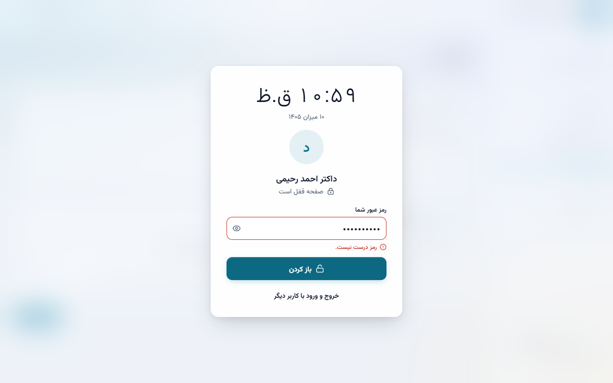

   * رمز **اشتباه** ← ✅ زیر کادر «رمز درست نیست.».
   * رمز **درست** ← ✅ برنامه فوراً باز شود و صفحه «درباره برنامه» عادی باشد — **هیچ پیام «صفحه قفل است»** نیاید.
2. این کار را **سه بار پشت سر هم** تکرار کنید ← ✅ هر سه بار بار اول باز شود.
3. **کار بدون کلیک:** حدود ۲ دقیقه فقط موس را روی صفحه حرکت دهید یا متن صفحه را با چرخ موس بالا و پایین کنید (هیچ دکمه‌ای نزنید) ← ✅ صفحه **قفل نشود** (کاربری که با برنامه کار می‌کند نباید قفل شود).
4. **قفل خودکار دقیق (OF-012):** در صفحه «درباره برنامه» بمانید (این صفحه خودش هر چند ثانیه تازه می‌شود). ساعت ویندوز یا گوشی را نگاه کنید و از لحظه آخرین حرکت موس **به موس و کیبورد دست نزنید** ← ✅ صفحه **بین ۶۰ تا ۶۵ ثانیه** بعد قفل شود (نه ۲ دقیقه، و نه هرگز). با رمز درست باز کنید ← ✅ فوراً باز شود.
   * بدون خروج از برنامه، در تنظیمات قفل خودکار را روی `2` بگذارید و ذخیره کنید؛ دوباره دست نزنید ← ✅ حدود **۲ دقیقه** بعد قفل شود (تنظیم تازه فوراً اعمال شده است). بعد دوباره روی `1` برگردانید.
5. در صفحه قفل ساعت بزرگ ۱۲ ساعته (ق.ظ/ب.ظ) و تاریخ امروز دیده شود.
6. در پایان، قفل خودکار را در تنظیمات دوباره روی `10` بگذارید.

---

## ۱۴. تغییر رمز

از منوی کاربر ← **تغییر رمز**. رمز فعلی را اشتباه بنویسید و رمز جدید را دو بار ← **تغییر رمز** ← ✅ زیر کادر «رمز فعلی» بنویسد «رمز درست نیست.». با کلید `Esc` پنجره را ببندید.

---

## ۱۵. زبان‌ها و دو ظاهر

پایین منوی کناری، به ترتیب **English**، **پښتو** و دوباره **دری** را بزنید؛ در هر کدام از منوی کاربر **روشن** و **تیره** را هم امتحان کنید.

✅ **باید ببینید:** در English همه چیز از چپ به راست و ساعت‌ها با `AM/PM`؛ در پشتو ساعت‌ها با `غ.م / غ.و`؛ متن‌ها کامل، هیچ دکمه یا جدولی از صفحه بیرون نزند؛ تیره و روشن هر دو خوانا و زیبا.

✅ (OF-013) در پشتو، در «اطلاعات کلینیک ← ساعات کاری» نام روزها **خالي، یونۍ، دونۍ، درېنۍ، څلورنۍ، پنځنۍ، جمعه** باشد و در ویزارد عنوان مرحله ظاهر «بڼه او رنګونه».

> اگر متن پشتو عجیب یا نادرست بود، آن را در [docs/i18n/pashto-review.md](../i18n/pashto-review.md) یادداشت کنید.

---

## ۱۶. دسترسی محدود پذیرش

از منوی کاربر ← **خروج**. با `reception` / `reception-123` وارد شوید.

✅ **باید ببینید:** در منوی کناری فقط «درباره برنامه» باشد (نه کاربران، پشتیبان‌گیری، گزارش، تنظیمات، اطلاعات کلینیک). خروج.

---

## ۱۷. صفحه شروع

برنامه را کامل ببندید و دوباره باز کنید ← ✅ حدود یک ثانیه لوگوی Artaveo روی زمینه سیاه با یک نوار طلایی متحرک، بعد صفحه ورود.

---

## ۱۸. بازیابی رمز مالک با کلید بازیابی

1. در صفحه ورود ← «رمز مالک را فراموش کرده‌اید؟ بازیابی با کلید بازیابی».
2. یک کلید **غلط** بنویسید و رمز جدید ← **تغییر رمز مالک** ← ✅ زیر کادر کلید: «کلید بازیابی با این کلینیک مطابقت ندارد…».
3. کلید درست (مرحله ۳) و رمز جدید ← ✅ «رمز مالک تغییر کرد. اکنون وارد شوید.». با رمز جدید وارد شوید.

---

## ۱۹. ثبت نتیجه

**کامپیوتر:** ……………… **System type:** ……………… **فایل نصب‌شده:** ………………

### الف) مراحل فاز ۲

| # | مرحله | قبول ✅ / رد ❌ | توضیح یا نام فایل عکس |
|---|---|---|---|
| 1 | ارتقا روی نسخه قبلی و حفظ اطلاعات | | |
| 2 | شروع تازه و باز شدن ویزارد | | |
| 3 | ویزارد راه‌اندازی (همه مراحل) و کلید بازیابی | | |
| 4 | صفحه ورود | | |
| 5 | ظاهر کلی برنامه | | |
| 6 | جستجوی سریع، اعلان‌ها، منوی کاربر، حالت کارایی | | |
| 7 | درباره برنامه (نسخه 0.2.1) | | |
| 8 | پشتیبان‌گیری | | |
| 9 | تنظیمات | | |
| 10 | اطلاعات کلینیک و لوگو | | |
| 11 | کاربران | | |
| 12 | گزارش رویدادها | | |
| 13 | قفل صفحه | | |
| 14 | تغییر رمز | | |
| 15 | سه زبان × دو ظاهر | | |
| 16 | دسترسی محدود پذیرش | | |
| 17 | صفحه شروع | | |
| 18 | بازیابی رمز مالک | | |

### ب) رفع شدن بازخوردهای شما

| # | بازخورد | کجا بررسی شد | رفع شد ✅ / نشد ❌ | توضیح |
|---|---|---|---|---|
| OF-001 | خطای زنده نام کاربری فارسی | بخش ۳ (مرحله ۱۰) و ۱۱ | | |
| OF-002 | خطای Core زیر همان کادر | بخش ۱۱ (مرحله ۳) | | |
| OF-003 | راهنمای فرمت از ابتدا و قرمز شدن قبل از دکمه، در همه فرم‌ها | بخش ۳ و ۹ | | |
| OF-004 | حروف فارسی وصل در کادرهای LTR | بخش ۴ | | |
| OF-005 | هم‌ترازی ستون‌ها در جدول‌ها | بخش ۱۱ و ۱۲ | | |
| OF-006 | تاریخ و ساعت خوانا در «درباره برنامه» | بخش ۷ | | |
| OF-007 | ساعت ۱۲ ساعته در کل سیستم و انتخاب‌گر ۱۲ ساعته | بخش ۳، ۸، ۹، ۱۰، ۱۲، ۱۵ | | |
| OF-008 | قفل صفحه | بخش ۱۳ | | |
| OF-009 | ارتقا به‌جای نصب کنار هم | بخش ۱ | | |
| OF-010 | بازطراحی کامل ظاهر | بخش ۵ و همه صفحه‌ها | | |
| OF-011 | برندینگ کلینیک و Artaveo | بخش ۴، ۵، ۷، ۱۰، ۱۷ | | |
| OF-012 | قفل خودکار دقیق (۶۰ تا ۶۵ ثانیه) و اعمال فوری تنظیم | بخش ۱۳ (مرحله ۴) | | |
| OF-013 | اصلاحات پشتو (نام روزها، «بڼه او رنګونه») | بخش ۱۵ | | |

نتیجه را همراه عکس‌ها برای تیم توسعه بفرستید. بعد از قبول این نسخه، فاز ۳ شروع می‌شود.

---

عکس‌های این راهنما با `ui/scripts/guide-screens.mjs` گرفته شده‌اند (داده نمونه). برای تست فقط از حساب‌ها و اطلاعات آزمایشی استفاده کنید.
